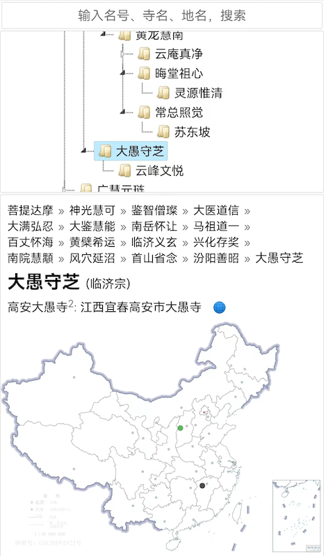

# ZenMap

东土禅宗法源地图，静态网页，欢迎扩充修正

## 文件说明

- `data.js`: 核心数据，有寺院地点、禅师法承，可扩充修正
  - 经纬度 用 [识取工具](https://jingweidu.bmcx.com) 获取

- `map.js`: 搜索等交互控制
  - 模糊搜索 用 `Fuse.js`
  - 树视图 用 `jsTree`
  - 地图显示 用 `SVG.js`

- `index.html`: 静态网页
  - `#map>svg` 下载于自然资源部的EPS文件，转为SVG，加了部分省会的经纬度用以显示校准
